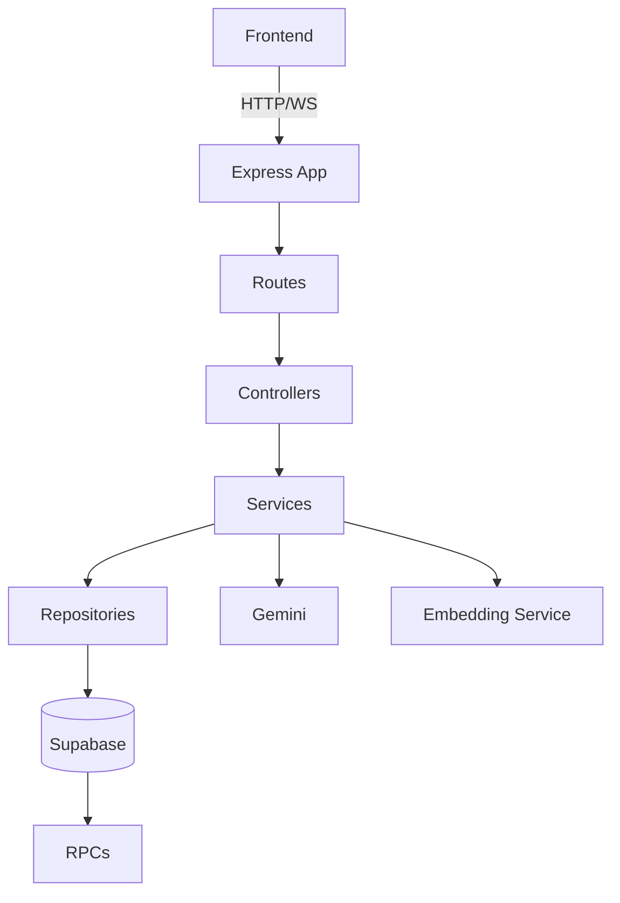
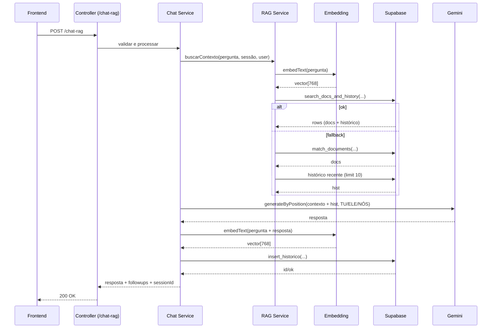

# Arquitetura

## Camadas
- routes: registram endpoints HTTP
- controllers: validam e orquestram req/res
- services: regras de negócio (auth, chat, rag, embedding)
- repositories: persistência (Supabase) e RPCs
- clients: SDKs externos (Supabase, Gemini)
- middlewares: auth JWT, tratamento de erros
- utils: helpers (asyncHandler, position, styler)
- ws: inicialização de WebSocket

## Diagrama de componentes

## Fluxo /chat-rag

