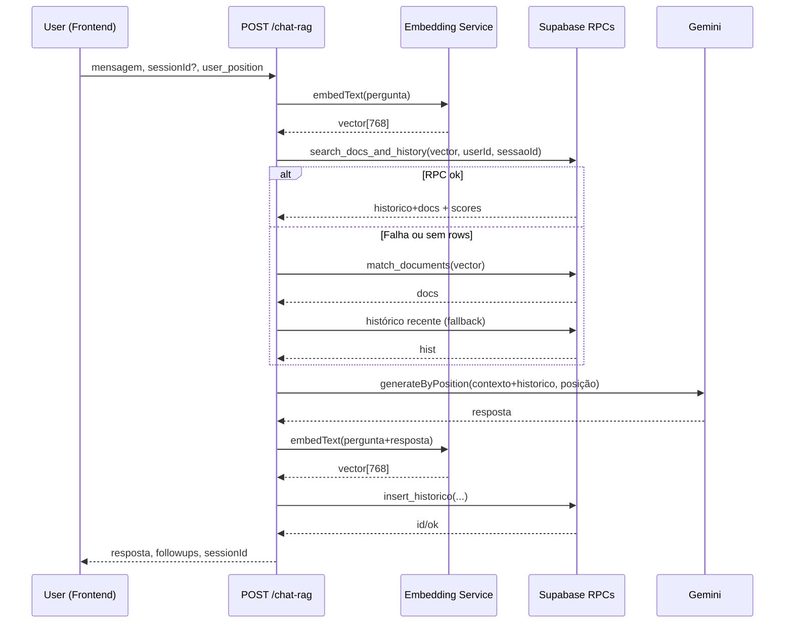

# Assistente Neurocom — Backend

Backend em Node.js/Express com:
- Autenticação JWT e login via Google ID Token
- Integração com Supabase (persistência e RPCs)
- Integração com Google Generative AI (Gemini) para geração e embeddings (RAG)
- Camadas modulares (controllers → services → repositories → clients)
- WebSocket (ws) para recursos em tempo real
- Deploy no Render

## Sumário
- [Diagrama de arquitetura](#diagrama-de-arquitetura)
- [Diagrama RAG/Embeddings](#diagrama-ragembeddings)
- [Estrutura de pastas](#estrutura-de-pastas)
- [Configuração (.env)](#configuração-env)
- [Instalação e execução](#instalação-e-execução)
- [Healthcheck](#healthcheck)
- [Autenticação](#autenticação)
- [Referência de API com exemplos e status codes](#referência-de-api-com-exemplos-e-status-codes)
- [WebSocket](#websocket)
- [RAG e Embeddings](#rag-e-embeddings)
- [Segurança](#segurança)
- [Deploy no Render](#deploy-no-render)

---

## Diagrama de arquitetura
```mermaid
graph TD
  F[Frontend] -->|HTTP/WS| API[Express App (src/app.js)]
  API -->|Routes| CTR[Controllers]
  CTR --> SRV[Services]
  SRV --> REP[Repositories]
  SRV --> LLM[Gemini (Google Generative AI)]
  SRV --> EMB[text-embedding-004 (768d)]
  REP --> DB[(Supabase Postgres)]
  DB --> RPCs[RPCs: search_docs_and_history, match_documents, insert_historico]
  SRV --> WS[WebSocket Server (ws)]
```

## Diagrama RAG/Embeddings


## Estrutura de pastas
```
src/
  app.js
  server.js
  config/
    env.js
  clients/
    supabase.js
    gemini.js
  middlewares/
    auth.js
    error.js
  utils/
    asyncHandler.js
    position.js
    styler.js
  repositories/
    user.repository.js
    session.repository.js
    history.repository.js
  services/
    auth.service.js
    chat.service.js
    rag.service.js
    embedding.service.js
    llm/
      engine.js
    googleToken.service.js
  controllers/
    auth.controller.js
    chat.controller.js
    sessions.controller.js
    history.controller.js
    debug.controller.js
  routes/
    index.js
    auth.routes.js
    chat.routes.js
    sessions.routes.js
    history.routes.js
    debug.routes.js
  ws/
    realtime.js
docs/
  openapi.yaml
  ARCHITECTURE.md
  RAG.md
  WEBSOCKET.md
.env.example
```

## Configuração (.env)
Copie `.env.example` para `.env` e preencha:

| Variável | Descrição |
|---|---|
| PORT | Porta do servidor (Render define automaticamente) |
| JWT_SECRET | Segredo do JWT |
| FRONT_URL | Origem permitida no CORS (ex.: http://localhost:5173 ou domínio do frontend) |
| SUPABASE_URL | URL do Supabase |
| SUPABASE_KEY | Chave do Supabase |
| GEMINI_API_KEY | Chave do Google Generative AI |
| GOOGLE_CLIENT_ID | Client ID do OAuth p/ verificar Google ID Token |

## Instalação e execução
```bash
npm install
npm start
# Servidor em http://localhost:3000
```

## Healthcheck
- GET /health → { ok: true }

## Autenticação
- JWT via header: Authorization: Bearer <token>
- Fluxos:
  - Cadastro local: POST /usuarios
  - Login local: POST /login
  - Login Google: POST /auth/google-token (credential: ID token do Google)
  - Perfil: GET /me

## Referência de API com exemplos e status codes

- POST /chat-rag
  - Descrição: Gera resposta no estilo dialógico (TU/ELE/NÓS) com RAG.
  - Request (exemplo):
    ```json
    {
      "mensagem": "Podes me lembrar as últimas 3 mensagens que te enviei?",
      "sessionId": "uuid-da-sessao",
      "user_position": "TU",
      "gerar_perguntas": true
    }
    ```
  - Response 200:
    ```json
    {
      "resposta": "Aqui estão as últimas 3 mensagens...",
      "sessionId": "uuid-da-sessao",
      "user_position": "TU",
      "followups": ["O que mudou para ti depois disso?"]
    }
    ```
  - Status codes: 200 OK, 400 Bad Request (mensagem ausente), 401 Unauthorized (sem token), 500 Internal Error

- GET /debug/rag-search (Auth)
  - Descrição: Inspeciona resultados do retrieval.
  - Exemplo: /debug/rag-search?q=afasia&sessionId=<uuid>&docsK=8&histK=6
  - Response 200 (trecho):
    ```json
    {
      "query": "afasia",
      "took_ms": 42,
      "total": 10,
      "documentos": [{ "id": 12, "similarity": 0.87, "score": 0.87, "preview": "..." }],
      "historico": [{ "id": 201, "similarity": 0.65, "score": 0.71, "preview": "..." }],
      "raw_top3": [{ "id": 12, "tipo": "documento", "sim": 0.87, "score": 0.87, "preview": "..." }]
    }
    ```
  - Status codes: 200, 400 (q/sessionId ausentes), 401, 404 (sessão), 500

- Auth e usuários
  - POST /usuarios → 200 OK
    ```json
    { "usuario": { "id": 1, "nome": "Ana", "email": "ana@ex.com" }, "token": "..." }
    ```
    Erros: 400 (campos), 500
  - POST /login → 200 OK
    ```json
    { "token": "..." }
    ```
    Erros: 400 (campos), 401 (credenciais), 500
  - POST /auth/google-token → 200 OK
    ```json
    { "token": "...", "usuario": { "id": 1, "nome": "Ana", "email": "ana@ex.com" } }
    ```
    Erros: 400 (credential/email ausente), 401 (token inválido), 403 (email não verificado)
  - GET /me → 200 OK
    ```json
    { "id": 1, "nome": "Ana", "email": "ana@ex.com", "avatar_url": null, "provider": "google" }
    ```
    Erros: 401, 404

- Sessões (Auth)
  - POST /sessoes → 201 Created
    ```json
    { "sessao": { "id": "uuid", "titulo": null, "usuario_id": 1, "criado_em": "..." } }
    ```
    Erros: 401, 500
  - GET /sessoes → 200 OK
    ```json
    { "sessoes": [{ "id":"uuid","titulo":"...","criado_em":"...","ultima_atividade":"..." }] }
    ```
  - PATCH /sessoes/:id → 200 OK
    ```json
    { "sessao": { "id": "uuid", "titulo": "Novo título" } }
    ```
    Erros: 400 (título), 401, 404 (sessão), 500

- Histórico (Auth)
  - GET /chat-historico/:sessionId → 200 OK
    ```json
    { "mensagens": [{ "id":1, "pergunta":"...", "resposta":"...", "criado_em":"..." }] }
    ```
    Erros: 401, 404 (sessão), 500

Consulte [docs/openapi.yaml](docs/openapi.yaml) para esquemas e exemplos formais.

## WebSocket
- Conexão: usa o mesmo servidor HTTP (src/server.js) via ws.
- URL típica: `wss://<seu-serviço-render>` (rota depende da sua implementação em `src/ws/realtime.js`).
- Autenticação: envie o JWT como querystring (?token=...) ou na primeira mensagem após conectar (recomendado alinhar com sua implementação).
- Eventos sugeridos:
  - join: cliente entra numa sessão
    ```json
    { "type": "join", "sessionId": "uuid" }
    ```
  - message: envio de mensagem
    ```json
    { "type": "message", "sessionId": "uuid", "text": "olá" }
    ```
  - leave: saída da sessão
    ```json
    { "type": "leave", "sessionId": "uuid" }
    ```
  - server-broadcast: broadcast do servidor
    ```json
    { "type": "server-broadcast", "event": "joined", "sessionId": "uuid", "userId": 1 }
    ```
- Ajuste os tipos conforme sua lógica em `src/ws/realtime.js`. Veja [docs/WEBSOCKET.md](docs/WEBSOCKET.md) para detalhes.

## RAG e Embeddings
- Modelo de embedding: `text-embedding-004`, 768 dimensões (validado no serviço).
- Pipeline:
  1) embedText(pergunta)
  2) RPC `search_docs_and_history` (score por similaridade e recência)
  3) Fallback: `match_documents` + histórico recente
  4) generateByPosition (LLM)
  5) embedText(pergunta+resposta) e `insert_historico`
- Tuning:
  - minSimDocs padrão: 0.30
  - minSimHist padrão: 0.25
  - recency_half_life_seconds: 86400 (decay ~1 dia)
- Detalhes e SQLs completas em [docs/RAG.md](docs/RAG.md).

## Segurança
- JWT com expiração (1h)
- Hash de senha com bcrypt (compatibilidade com legado em texto puro, mas recomenda-se migração)
- CORS restrito a FRONT_URL
- Não logar tokens ou dados sensíveis
- Erros 500 não expõem stack em produção
- Rate limiting recomendado em rotas públicas

## Deploy no Render
- Build Command: `npm install`
- Start Command: `npm start`
- Health Check Path: `/health`
- Env vars: SUPABASE_URL, SUPABASE_KEY, GEMINI_API_KEY, JWT_SECRET, FRONT_URL, GOOGLE_CLIENT_ID
